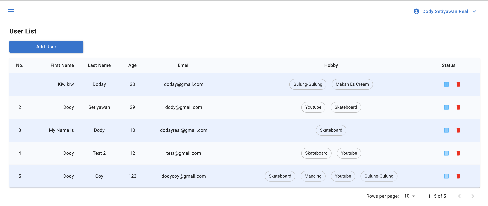
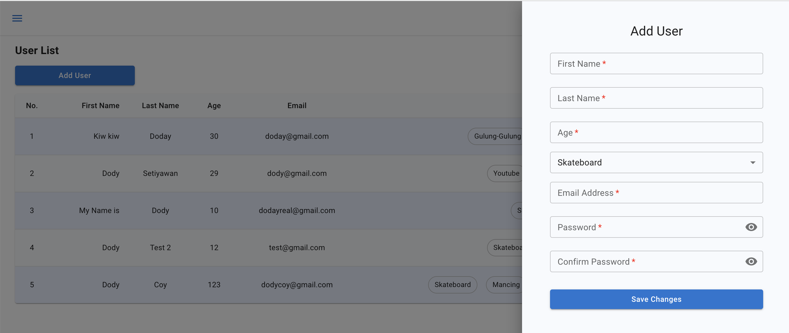
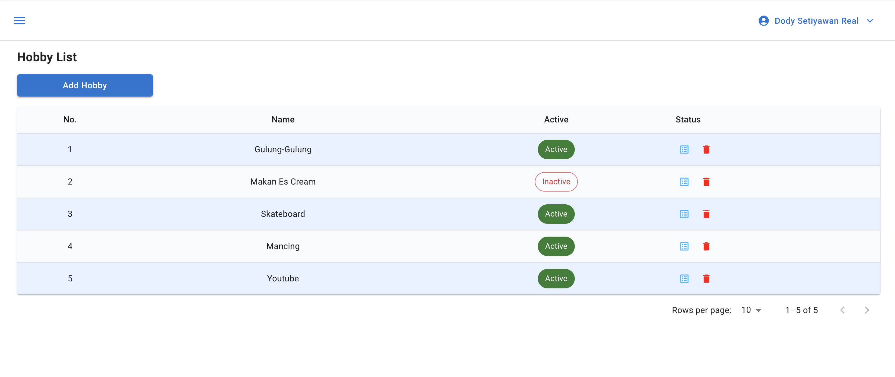
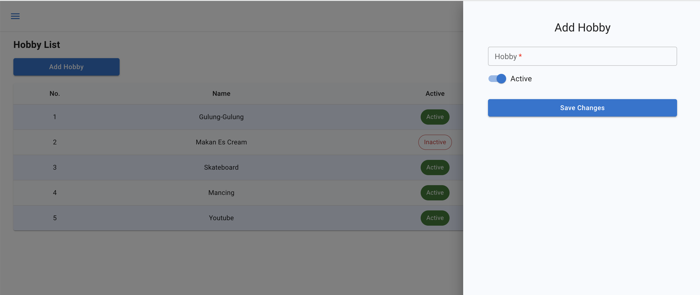

# User Application

## Description

User List - Makes it easier for you to see the user as a whole

Add User - Add your new user

Hobby List - Makes it easier for you to see the hobby as a whole

Add Hobby - Add your new hobby

## Technologies Used

- React JS
- Material UI & Tailwind
- and Typescript

## Usage

1. Clone this project using cli `https://github.com/dodimoop/tekuton-fe.git`
2. You can clone this project (use HTTPS) and run `git clone https://github.com/dodimoop/tekuton-fe.git` on your terminal
3. Move to inside project folder `cd tekuton-fe`
4. Install all dependencies, and run `yarn` or `npm install` on your terminal
5. Run `yarn start` or `npm run start` on your terminal and then open [http://localhost:3000](http://localhost:3000) to view it in the browser.

Thank you :)
